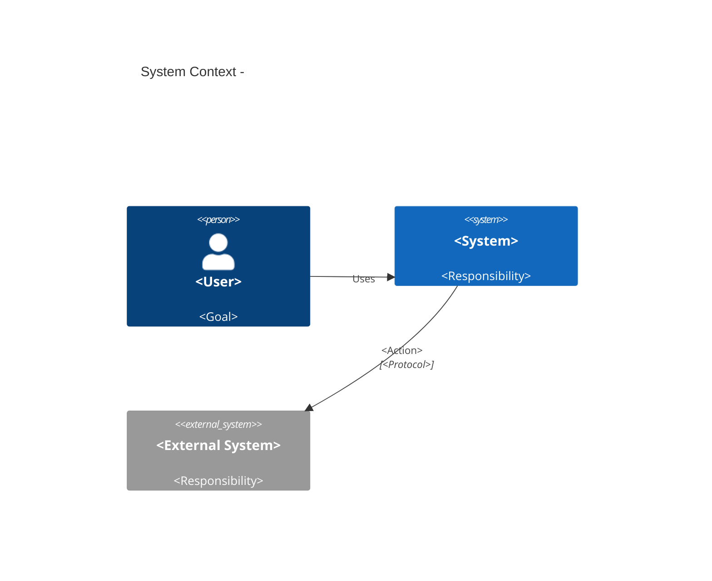
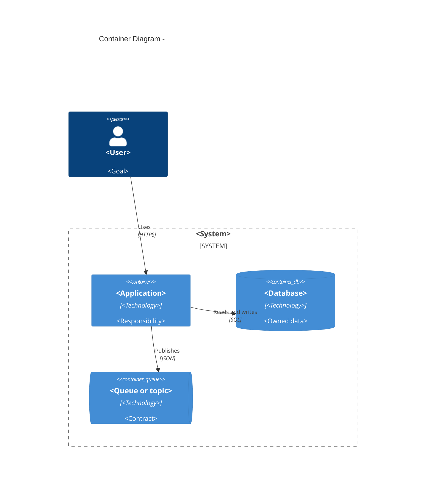
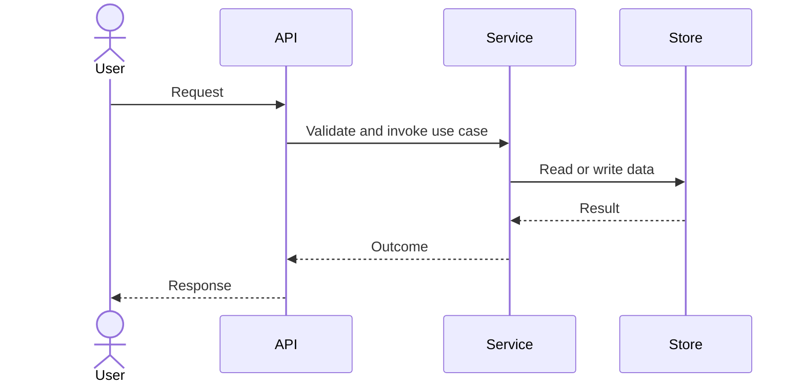

# Mermaid Architecture Skill

Use Mermaid as version-controlled architecture documentation, not as decoration. Before drawing, state the question the diagram answers, its audience, and the evidence or decision it represents.

## Official references

Use the official Mermaid documentation when syntax, version support, or renderer behavior is uncertain:

- Introduction: https://mermaid.js.org/intro/
- Syntax overview: https://mermaid.js.org/intro/syntax-reference.html
- Flowcharts: https://mermaid.js.org/syntax/flowchart.html
- Sequence diagrams: https://mermaid.js.org/syntax/sequenceDiagram.html
- Entity relationship diagrams: https://mermaid.js.org/syntax/entityRelationshipDiagram.html
- Class diagrams: https://mermaid.js.org/syntax/class.html
- State diagrams: https://mermaid.js.org/syntax/stateDiagram.html
- C4 diagrams: https://mermaid.js.org/syntax/c4.html
- Architecture diagrams: https://mermaid.js.org/syntax/architecture.html
- Configuration and theming: https://mermaid.js.org/config/configuration.html

C4 concepts: https://c4model.com/

Do not invent Mermaid syntax from memory when the official reference can answer the question. Mermaid support differs across Mermaid versions and Markdown renderers; prefer syntax supported by the project's actual renderer.

## Workflow

1. **Name the question and audience.** Examples: “What is inside the system boundary?” or “How does checkout recover when payment times out?”
2. **Choose one abstraction level.** Do not mix context, containers, implementation classes, and infrastructure in one unreadable diagram.
3. **Collect evidence.** For an existing system, inspect code, docs, ADRs, manifests, deployment configuration, and existing diagrams. Mark inferred or unknown relationships.
4. **Select the smallest useful diagram type** using the table below.
5. **Write the diagram and a prose explanation.** Explain important boundaries, ownership, data flow, and omitted detail.
6. **Review for correctness and readability.** Check that every node and relationship is justified and agrees with the text and ADRs.
7. **Validate.** Check fenced-block syntax and, when available, render with the repository's existing Mermaid tooling. Do not install a renderer or make external calls without user permission.
8. **Save with the project's convention.** Prefer existing documentation locations; otherwise architecture diagrams commonly live under `docs/architecture/` and focused source diagrams may use `.mmd` files next to the relevant docs.

## Diagram selection

| Need | Mermaid type | Typical output |
|---|---|---|
| System boundary and external actors | `C4Context` | Users, system, external systems |
| Deployable/runtime units and data stores | `C4Container` | Web app, API, worker, database, queue |
| Internal structure of one container | `C4Component` | Components, ports, adapters, modules |
| Production placement | `C4Deployment` | Nodes, regions, clusters, containers |
| One important request or event path | `C4Dynamic` or `sequenceDiagram` | Ordered calls, responses, failure paths |
| Domain/data relationships | `erDiagram` | Entities, cardinality, keys |
| Object/domain model | `classDiagram` | Types, responsibilities, relationships |
| Lifecycle and transitions | `stateDiagram-v2` | States, commands/events, guards |
| Business process or decision flow | `flowchart TD`/`LR` | Steps, branches, outcomes |
| CI/CD or branching | `flowchart` or `gitGraph` | Stages or branch history |

### C4 guidance

- Start with context and container diagrams. Add component, dynamic, or deployment views only when they answer a real question.
- A **container** is an independently runnable or separately deployable application/data store—not merely a folder or class.
- A **component** is a meaningful internal building block inside a container—not every file.
- Model individual queues/topics when their contracts matter; do not hide important event semantics behind one generic “message bus” box.
- Use `Rel` labels with action verbs and include the protocol/technology when useful.
- Use one-way relationships by default. Use bidirectional relationships only when both directions are truly meaningful.
- Keep the system boundary and ownership visible. If ownership is unknown, label it as unknown rather than guessing.

## Architecture diagram rules

- One diagram should answer one primary question.
- Prefer fewer than 20 meaningful elements. Split large diagrams by view, boundary, or workflow.
- Give every node a meaningful stable alias and a concise label/description.
- Use direction intentionally (`TD`, `LR`, or the appropriate C4 layout).
- Label edges with verbs: “publishes”, “reads”, “authorizes”, “calls”, “subscribes to”, “persists”.
- Avoid crossing boundaries without naming the contract, protocol, or trust implication.
- Do not show implementation detail at a higher-level view.
- Use colors only when they carry consistent meaning and provide a legend or prose explanation. Avoid relying on color alone.
- Quote labels containing punctuation or special characters when required by Mermaid syntax.
- Keep IDs simple: letters/numbers/underscores; put display text in labels.
- Avoid giant diagrams, decorative icons, unexplained abbreviations, and duplicate nodes representing the same thing.
- Never let the diagram silently contradict the architecture narrative, ADRs, or code. Record drift as a finding.

## Required companion text

Every architecture diagram should be accompanied by:

- **Purpose and audience**
- **Scope and level**
- **Evidence/source of truth** (files, ADRs, or explicit assumptions)
- **Reading guide** describing the key boundaries and flows
- **Important omissions**
- **Accessibility summary** in plain language
- **Last reviewed** date or review context when the repository tracks freshness

For a decision diagram, link it to the ADR and explain which option it represents. For a current-state diagram, distinguish observed relationships from inferred ones.

## Focused templates

### C4 context

### C4 containers

### Sequence / dynamic flow

Add `alt`, `opt`, or `par` blocks for meaningful failure, retry, or concurrency paths. Do not imply retries, transactions, or exactly-once delivery unless evidence or a decision supports them.

## Validation checklist

Before delivering a diagram, verify:

- [ ] The diagram type matches the question and audience.
- [ ] Scope, system boundary, ownership, and abstraction level are clear.
- [ ] Nodes and relationships come from evidence or are labeled assumptions.
- [ ] Relationships use meaningful action labels and relevant protocols.
- [ ] Data ownership, trust boundaries, failure behavior, and async edges are not hidden.
- [ ] The diagram is focused and readable without color or hover behavior.
- [ ] Companion prose includes purpose, evidence, omissions, and an accessibility summary.
- [ ] It agrees with the current architecture narrative and related ADRs.
- [ ] Syntax was checked against the official docs and rendered when tooling exists.
- [ ] The file path and naming follow repository conventions.
